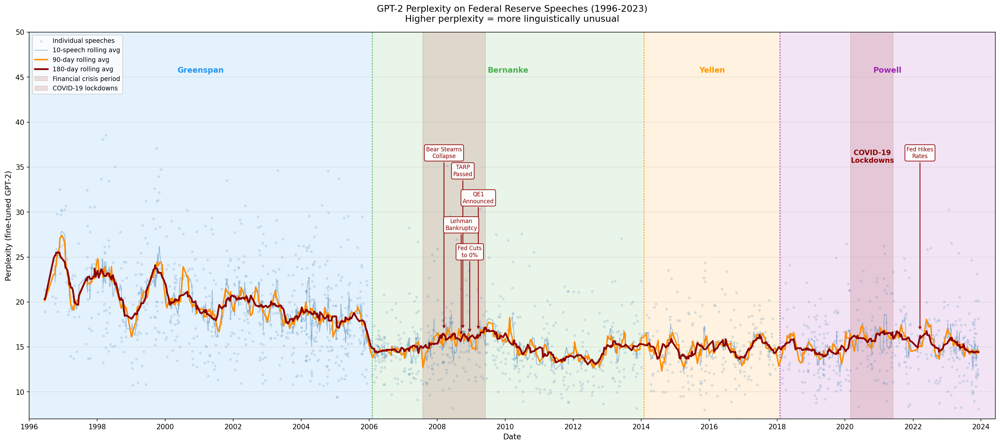
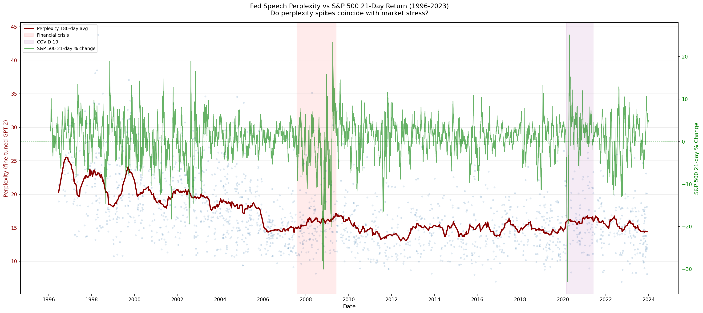
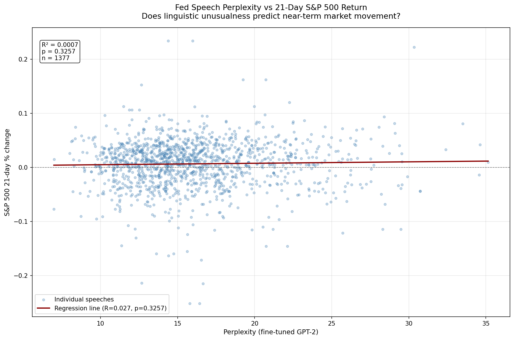

# Federal Reserve Speech Analysis
Fine-Tuning GPT-2 on 1,700+ Federal Reserve speeches (1996-2023) to model central bank language and explore any correlation between transformer perplexity and market volatility.


## 🔰: Overview
Central banks communicate carefully, every word in a speech is chosen deliberately - but some speeches are more linguistically unusual than others. This project investigates the question: can a fine-tuned language model detect when the Fed is saying something unexpected, and does that translate to volatility in the market?

To answer this I scraped every publicly available Fed speech from 1996 - 2023, fine-tuned GPT-2 on the corpus using LoRA, and measured per-speech perplexity as a proxy for linguistic abnormalities. I then correlated these perplexity scores against S&P 500 forward and backward returns across 1, 5, 90, and 180 day time horizons.

## :zap: Key Findings

### **1. Greenspan-era speeches are systematically more unusual**

Pre-2006 speeches show a significantly higher perplexity, consistent with Greenspan's well-documented preference for deliberately complex and unusual speeches in order to conceal his true opinion and intentionally supress any market response - later referred to as "Fedspeak." Bernanke's transparency produced a measurable shift toward a more predictable Fed speeches.

### **2. Crisis-period speeches spike in perplexity**

Speeches during the 2008-2009 financial crisis show remarkably higher perplexity, with several speeches exceeding 3 std. dev. above the mean: "Financial Market Trumoil and the Federal Reserve: The Plot Thickens" and "The Panic of 2008."

### **3. Perplexity correlates with future market returns**

Same-day volatility showed no significant correlation (p=0.13). 21-day and 180-day forward returns, however, hsowed statistically significant correlations (R^2=0.01, p<0.001), suggesting that perplexity shows weak but reliable information about market volatility.

--- 
## :computer: Visualizations

### Perplexity Over Time by Fed Chair


### Perplexity vs S&P 500 21-Day Return


### Perplexity vs S&P 500 (Scatter)


---

## :file_folder: Project Structure
```
fed-speech-analysis/
├── scraper.py              # Scrapes speech index and full text
├── data_cleaning.py        # Cleans and validates the corpus
├── finetune.py             # Fine-tunes GPT-2 with LoRA
├── perplexity.py           # Computes per-speech perplexity
├── analysis.py             # Correlation analysis vs market data
├── visualize.py            # All visualizations
├── data/                   # Generated by running scripts (not tracked)
└── graphs/                 # Output visualizations
```

## :gear: Setup
```bash
pip install transformers datasets peft accelerate torch
pip install requests beautifulsoup4 pandas yfinance matplotlib scipy
```

## ⏯️ Usage
Run Scripts in order:

```bash
python scraper.py
python data_cleaning.py
python finetune.py
python perplexity.py
python analysis.py
python visualize.py
```

## Methodology

**Data collection**
Scraped 1,800 + speeches from federalreserve.gov spanning 1996-2023, handling three distinct HTML structures across the site's history. Implemented checkpoint and retry logic.

**Fine-tuning**
Fine-tuned GPT-2 (124M parameters) using LoRA (r=16, target modules: c_attn and c_proj) for 3 epochs on 1,697 cleaned speaches (batch size of 4). Final eval loss: 2.811.

**Perplexity**
Computed per-speech perplexity using the fine-tuned model as a measure of linguistic oddity. A lower perplexity means the model finds the speech predictable, while a higher perplexity means the speech is linguistically surprising to the model.

**Market Correlation**
Merged speech dates with S&P 500 daily close (adjusting for holidays and weekends) and tested correlations across 1-day, 5-day, 10-day, 21-day, 90-day, and 180-day windows.

## Future Work
- Test with larget models
- Incroporate FOMC meeting minutes alongside speeches
- Extend analysis to other central banks

## Technical Stack
Python, PyTorch, HuggingFace Transformers, PEFT/LoRA, BeautifulSoup, pandas, yfinance, matplotlib, scipy


